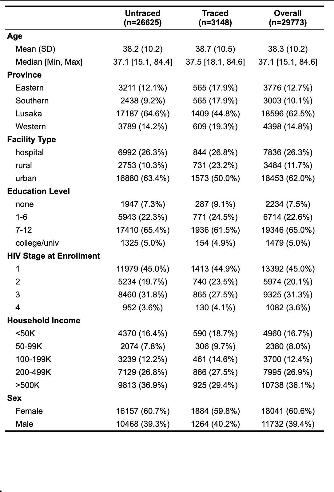

```{r setup, include=FALSE}
knitr::opts_chunk$set(echo = FALSE)
library(tidyverse)
library(skimr)
library(survival)
library(survminer)
library(table1)

full_data <- read_rds("../data/imputed_data.RDS")
txt_data <- full_data %>% filter(traced == 1)
control_data <- full_data %>% filter(traced == 0)

returned <- filter(full_data, !is.infinite(T_ltfu))
txt_returned <- returned %>% filter(traced == 1)
control_returned <- returned %>% filter(traced == 0)
```

## Group Introduction
- David Chen
  - Masters of Biostatistics interested in approaches to optimal dynamic treatment and applications in mental health
  
- Max Murphy
  - PhD. Biostatistics working on malaria transmission dynamics jointly with Dr. Rasmus Nielsen at UCB and Dr. Bryan Greenhouse at UCSF

## Study Background
<!-- A study was conducted in Zambia to improve estimates of baseline mortality due to HIV. In the context of this observational study, a subset of individuals who were lost to follow up were assigned to receive extra care through follow up outreach by community health workers. This raises the question of what are the impacts of this type of intervention, both in returning people to care as well as maintaining them over time. -->
- A 2015-2017 study was conducted in Zambia to improve estimates of baseline mortality due to HIV
- A subset of individuals who were lost to follow up were randomized to receive extra care through follow up outreach by community health workers 
- What are the impacts of this type of intervention
  - Returning people to care?
  - Retention in care over time?

## Target Population
\textbf{Pop 1}

Zambian, HIV positive adult patients on ART who are lost to follow-up ($\geq 90$ days late for their last appointment or $\geq 180$ days without clinic visit for patients with no future appointment scheduled at their last visit).

\vspace{.125in}

\textbf{Pop 2}

The subset of patients satisfying the above criteria who have also returned to care in the study period.


## Data 1

\[O = (W, A, \tilde{T}, \Delta)\text{, where } \tilde{T} = \min(T, C)\text{ and }\Delta = \mathbb{I}(T \leq C)\]

- $W$ = province, facility type, facility size, medication possession ratio (MPR, imputed), MPR Imputation Indicator, time on ART, number of prior lost events
- $A$ = Assignment to tracing as defined as in-depth review of paper and EMRs, phone calls, in-person tracing in community (using bicycles, public transport, study vehicles, or motorcycles) by peer health workers at least 3 times.
- $T$ = Time from loss to return (first post-LTFU clinic visit)
- $C$ = Time from loss to end of study

## Data 2
Data $O = (W, A, \tilde{T}, \Delta)$, where $\tilde{T} = \min(T, C)$ and $\Delta = \mathbb{I}(T \leq C)$

- $W$ = same as above
- $A$ = same as above
- $T$ = Time from return to 2nd LTFU (as defined on Slide 4)
- $C$ = Time from return to end of study

## Characteristics
```{r table_1, echo=FALSE, fig.align='center', fig.height=2}
# full_data$sex <- factor(full_data$male, levels = c(0, 1), labels = c('Female', 'Male'))
# full_data$traced_pretty <- factor(full_data$traced, levels = c(0, 1), labels = c('Untraced', 'Traced'))
# full_data$hh_inc <- factor(full_data$hh_inc, levels=c('<50K', '50-99K', '100-199K', '200-499K', '>500K'))
# label(full_data$age) <- 'Age'
# label(full_data$province) <- 'Province'
# label(full_data$fac_type) <- 'Facility Type'
# label(full_data$educ) <- 'Education Level'
# label(full_data$enroll_HIV_stage) <- 'HIV Stage at Enrollment'
# label(full_data$hh_inc) <- 'Household Income'
# label(full_data$sex) <- 'Sex'
# label(full_data$traced_pretty) <- 'Traced Status'
# full_data$event_return_pretty <- factor(full_data$event_return, levels = c(0, 1), labels = c('Censored', 'Returned'))
# full_data$event_ltfu_pretty <- factor(full_data$event_ltfu, levels = c(0, 1), labels = c('Censored', 'Re-LTFU'))
# table1(~ age + province + fac_type + educ + enroll_HIV_stage + hh_inc + sex | traced_pretty, data = full_data)
# table1(~ age + province + fac_type + educ + enroll_HIV_stage + hh_inc + sex + traced_pretty | event_return_pretty, data = full_data)
# 
# ltfu_data <- full_data %>% filter(event_return == 1)
# ltfu_data$sex <- factor(ltfu_data$male, levels = c(0, 1), labels = c('Female', 'Male'))
# ltfu_data$traced_pretty <- factor(ltfu_data$traced, levels = c(0, 1), labels = c('Untraced', 'Traced'))
# ltfu_data$hh_inc <- factor(ltfu_data$hh_inc, levels=c('<50K', '50-99K', '100-199K', '200-499K', '>500K'))
# label(ltfu_data$age) <- 'Age'
# label(ltfu_data$province) <- 'Province'
# label(ltfu_data$fac_type) <- 'Facility Type'
# label(ltfu_data$educ) <- 'Education Level'
# label(ltfu_data$enroll_HIV_stage) <- 'HIV Stage at Enrollment'
# label(ltfu_data$hh_inc) <- 'Household Income'
# label(ltfu_data$sex) <- 'Sex'
# label(ltfu_data$traced_pretty) <- 'Traced Status'
# ltfu_data$event_return_pretty <- factor(ltfu_data$event_return, levels = c(0, 1), labels = c('Censored', 'Returned'))
# ltfu_data$event_ltfu_pretty <- factor(ltfu_data$event_ltfu, levels = c(0, 1), labels = c('Censored', 'Re-LTFU'))
# table1(~ age + province + fac_type + educ + enroll_HIV_stage + hh_inc + sex + traced_pretty | event_ltfu_pretty, data = ltfu_data)

```

## Time to Return Characteristics

```{r time_to_return_characateristics, echo=FALSE, fig.align='center'}

```

## Time to Return Kaplan Meier
``` {r time_to_return_surv, warning=FALSE, message=FALSE}
time_to_return_survplot <- ggsurvplot(survfit(Surv(T_return, event_return, type = 'right') ~ traced, 
                                              data = full_data, type = 'kaplan-meier', conf.int = .95), 
                                      conf.int = T, pval = T, risk.table = T, legend = 'bottom')
time_to_return_survplot$plot <- time_to_return_survplot$plot + 
    xlim(0, 1000) +
    ylim(.5, 1) +
    ggtitle("Time to Return")
time_to_return_survplot
```

## Time to ReLoss Characteristics

```{r time_to_ltfu_characteristics, echo=FALSE, fig.align='center'}

```


## Time to ReLoss Kaplan Meier
```{r lost_to_follow_up_surv, warning=FALSE, message=FALSE}
lost_to_follow_up_survplot <- ggsurvplot(survfit(Surv(T_ltfu, event_ltfu, type = 'right') ~ traced, 
                                                 data = full_data %>% filter(event_return == 1), type = 'kaplan-meier', conf.int = .95), 
                                         conf.int = T, pval = T, risk.table = T, legend = 'bottom')
lost_to_follow_up_survplot$plot <- lost_to_follow_up_survplot$plot + 
    ylim(.5, 1) +
    xlim(0, 1000) +
    ggtitle("Time to Lost To Follow Up")
lost_to_follow_up_survplot
```


## Target Parameter
- The treatment specific survival curve, where $d(W)$ is a rule of interest.
- Our intervention $d(W)$ is actually a single time point static intervention - fixed to 1 or 0, reflecting the treatment specific survival curve of everyone receiving treatment vs. no one receiving treatment. 
- Interested in comparing the impact of tracing assignment on 
    - (1) time to return to care 
    - (2) duration of retention in care (assuming tracing has no effect on return to care)

## Target Parameter
\begin{align*}
    \Psi(P_0) = \mathbb{E}_{P_0}[S_0(t_0 | A = a, W)] \, , \, a \in \{0, 1\} \\
    S_0(t_0 | A, W) = \prod_{t \in [0, t_0]}(1 - \Lambda_0(dt | A, W))
\end{align*}

Thus our target parameter of interest only depends on $Q_W$ and $\lambda$.

- Plug-in Estimation
\begin{align*}
    \Psi(Q_{W,n}, \lambda^*_n) = \frac{1}{n}\sum_{i = 1}^n S_{\lambda^*_n}(t_0 | A = a, W) \, , \, a \in \{0, 1\}
\end{align*}
    
## Loss Function 
- Log-likelihood loss
    - Event (Return / Reloss) Hazard
    \[ L(\lambda)(O) = \text{-} \left\{ \prod_{t \leq \tilde{T}} \lambda(t \mid A, W )^{dN(t)} (1 - \lambda(t \mid A, W ))^{1 - dN(t)}\right\} \]
    - Censoring Hazard
    \[ L(\lambda_c)(O) = \text{-} \left\{ \prod_{t \leq \tilde{T}} \lambda_c(t \mid A, W )^{dA_c(t)} (1 - \lambda_c(t \mid A, W ))^{1 - dA_c(t)}\right\} \]

- Candidate Estimators
    - mean, glm, bayes glm$^*$, xgboost$^*$, stepwise forward regression


## Initial SL Estimates
\includegraphics[height=3.3in]{init_sl_fits.pdf}

## TMLE Update
\textbf{Efficient Influence Curve}
\begin{align*}
D^*(P)(O) &= D^*_0(Q) + \sum_{t=1}^{\tau} D^*_t(Q,G)\\
D^*_t(Q, G) &= C_t(Q, G) \, I(\tilde{T} \geq t)(dN(t) - \lambda(t \mid A, W))
\end{align*}

\textbf{Clever Covariate}
\[ C_t(Q, G) = \frac{I(A = a, \bar{A}_c(t-1) = 0)}{g(a \mid W) \prod\limits_{s \leq t-1}(1 - \lambda_c(s \mid A, W))} \frac{S(t_0\mid A, W)}{S(t \mid A, W)} \, , \, t \leq t_0 \]

\textbf{Least Favorable Submodel with Log-Likelihood Loss}
\[ \text{logit} \, \lambda_{n, \epsilon}(t \mid A, W) = \text{logit} \, \lambda_{n}(t \mid A, W) + \epsilon \, C_t(Q_n, G_n) \]


## Time to Return -- MOSS Estimate
\centering
\includegraphics[height=5in]{MOSS_return.pdf}

## Lost To Follow Up -- MOSS Estimate
\includegraphics[height=5in]{MOSS_reloss.pdf}

## Results
- We find no significant effect of follow up tracing assignment on return to care in this population
- We also find no significant effect of follow up tracing assignment on remaining in care amongst those that do return to care at some point during the study

## Limitations
- The primary purpose of the tracing intervention was information gathering rather than behavioral change
- Our adjustment set has been heavily reduced due to computational burden
- To interpret our second question causally, we require treatment to be independent of return

## Conclusion
- Thanks to Wilson Cai for MOSS, Mark and Rachel for facilitating this course, and Elvin Geng et. al. for our data.

- Questions?
