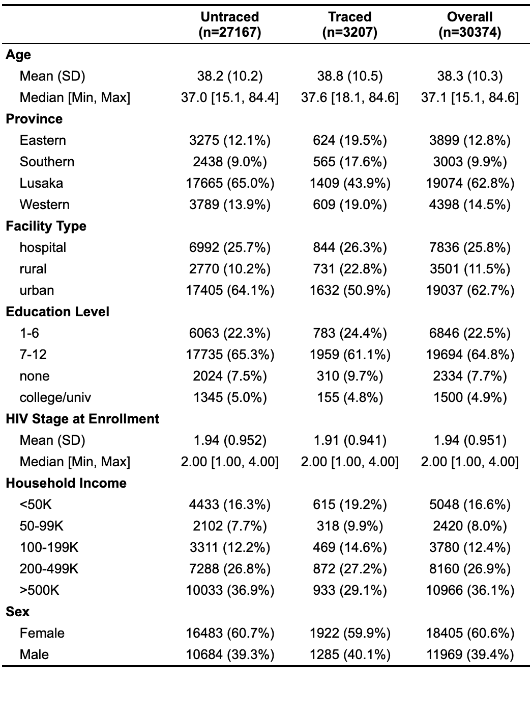

```{r setup, include=FALSE}
knitr::opts_chunk$set(echo = FALSE)
library(tidyverse)
library(skimr)
library(survival)
library(survminer)
library(table1)

full_data <- read_csv('../data/imputed_data.csv', col_types = cols(
    .default = col_double(),
    fac = col_factor(),
    province = col_factor(),
    fac_type = col_factor(),
    educ = col_factor(),
    educ_imp = col_logical(),
    enroll_HIV_stage_imp = col_logical(),
    hh_inc = col_factor(),
    hh_inc_imp = col_logical(),
    male_imp = col_logical(),
    marital = col_factor(),
    marital_imp = col_logical(),
    mpr_days_imp = col_logical(),
    mpr_imp = col_logical()
))

txt_data <- full_data %>% filter(traced == 1)
control_data <- full_data %>% filter(traced == 0)
```

## Group Introduction
- David Chen
  - Masters of Biostatistics interested in approaches to optimal dynamic treatment and applications in mental health
  
- Max Murphy
  - PhD. Biostatistics working on malaria transmission dynamics jointly with Dr. Rasmus Nielsen at UCB and Dr. Bryan Greenhouse at UCSF

## Study Background
<!-- A study was conducted in Zambia to improve estimates of baseline mortality due to HIV. In the context of this observational study, a subset of individuals who were lost to follow up were assigned to receive extra care through follow up outreach by community health workers. This raises the question of what are the impacts of this type of intervention, both in returning people to care as well as maintaining them over time. -->
- A 2015-2017 study was conducted in Zambia to improve estimates of baseline mortality due to HIV
- A subset of individuals who were lost to follow up were randomized to receive extra care through follow up outreach by community health workers 
- What are the impacts of this type of intervention
  - Returning people to care 
  - Maintaining care over time.

## Target Population
\textbf{Pop 1}

Zambian, HIV positive adult patients on ART who are lost to follow-up ($\geq 90$ days late for their last appointment or $\geq 180$ days without clinic visit for patients with no future appointment scheduled at their last visit).

\vspace{.125in}

\textbf{Pop 2}

Patients satisfying the above criteria who have also already returned to care.

## Target Parameter
The treatment specific survival curve

\begin{align*}
    \Psi(P_0) = \mathbb{E}_{P_0}[S_0(t_0 | A = d(w), W)] \\
    S_0(t_0 | A, W) = \prod_{t \in [0, t_0]}(1 - \Lambda_0(dt | A, W))
\end{align*}

We're interested in comparing the impact of tracing assignment on (1) time to return to care and (2) duration of retention in care.

## Progress - Data Processing
- Conducted data cleaning and imputation of missing values
- Compiled data set consisting of `r nrow(full_data)` entries
    - `r nrow(txt_data)` individuals assigned to treatment
    - `r nrow(control_data)` individuals assigned to control

## Characteristics
```{r table_1, echo=FALSE, fig.align='center', fig.height=2}
# full_data$sex <- factor(full_data$male, levels = c(0, 1), labels = c('Female', 'Male'))
# full_data$traced_pretty <- factor(full_data$traced, levels = c(0, 1), labels = c('Untraced', 'Traced'))
# full_data$hh_inc <- factor(full_data$hh_inc, levels=c('<50K', '50-99K', '100-199K', '200-499K', '>500K'))
# label(full_data$age) <- 'Age'
# label(full_data$province) <- 'Province'
# label(full_data$fac_type) <- 'Facility Type'
# label(full_data$educ) <- 'Education Level'
# label(full_data$enroll_HIV_stage) <- 'HIV Stage at Enrollment'
# label(full_data$hh_inc) <- 'Household Income'
# label(full_data$sex) <- 'Sex'
# label(full_data$traced_pretty) <- 'Traced Status'
# full_data$event_return_pretty <- factor(full_data$event_return, levels = c(0, 1), labels = c('Censored', 'Returned'))
# full_data$event_ltfu_pretty <- factor(full_data$event_ltfu, levels = c(0, 1), labels = c('Censored', 'Re-LTFU'))
# table1(~ age + province + fac_type + educ + enroll_HIV_stage + hh_inc + sex | traced_pretty, data = full_data)
# table1(~ age + province + fac_type + educ + enroll_HIV_stage + hh_inc + sex + traced_pretty | event_return_pretty, data = full_data)
# 
# ltfu_data <- full_data %>% filter(event_return == 1)
# ltfu_data$sex <- factor(ltfu_data$male, levels = c(0, 1), labels = c('Female', 'Male'))
# ltfu_data$traced_pretty <- factor(ltfu_data$traced, levels = c(0, 1), labels = c('Untraced', 'Traced'))
# ltfu_data$hh_inc <- factor(ltfu_data$hh_inc, levels=c('<50K', '50-99K', '100-199K', '200-499K', '>500K'))
# label(ltfu_data$age) <- 'Age'
# label(ltfu_data$province) <- 'Province'
# label(ltfu_data$fac_type) <- 'Facility Type'
# label(ltfu_data$educ) <- 'Education Level'
# label(ltfu_data$enroll_HIV_stage) <- 'HIV Stage at Enrollment'
# label(ltfu_data$hh_inc) <- 'Household Income'
# label(ltfu_data$sex) <- 'Sex'
# label(ltfu_data$traced_pretty) <- 'Traced Status'
# ltfu_data$event_return_pretty <- factor(ltfu_data$event_return, levels = c(0, 1), labels = c('Censored', 'Returned'))
# ltfu_data$event_ltfu_pretty <- factor(ltfu_data$event_ltfu, levels = c(0, 1), labels = c('Censored', 'Re-LTFU'))
# table1(~ age + province + fac_type + educ + enroll_HIV_stage + hh_inc + sex + traced_pretty | event_ltfu_pretty, data = ltfu_data)

```

## Progress - Analysis
- Currently exploring techniques of estimating survival curves
    - Attempting to use `survtmle` and `MOSS`
    - Issues with `MOSS` on this data set, experiencing memory usage problems

## Time to Return Characteristics

```{r time_to_return_characateristics, echo=FALSE, fig.align='center'}

```

## Time to Return Survival Curve
``` {r time_to_return_surv}
time_to_return_survplot <- ggsurvplot(survfit(Surv(T_return, event_return, type = 'right') ~ traced, 
                                              data = full_data, type = 'kaplan-meier', conf.int = .95), 
                                      conf.int = T, pval = T, risk.table = T, legend = 'bottom')
time_to_return_survplot$plot <- time_to_return_survplot$plot + ggtitle("Time to Return")
time_to_return_survplot
```

## Time to Return Characteristics

```{r time_to_ltfu_characteristics, echo=FALSE, fig.align='center'}

```

## Lost To Follow Up
```{r lost_to_follow_up_surv}
lost_to_follow_up_survplot <- ggsurvplot(survfit(Surv(T_ltfu, event_ltfu, type = 'right') ~ traced, 
                                                 data = full_data %>% filter(event_return == 1), type = 'kaplan-meier', conf.int = .95), 
                                         conf.int = T, pval = T, risk.table = T, legend = 'bottom')
lost_to_follow_up_survplot$plot <- lost_to_follow_up_survplot$plot + ggtitle("Time to Lost To Follow Up")
lost_to_follow_up_survplot
```


